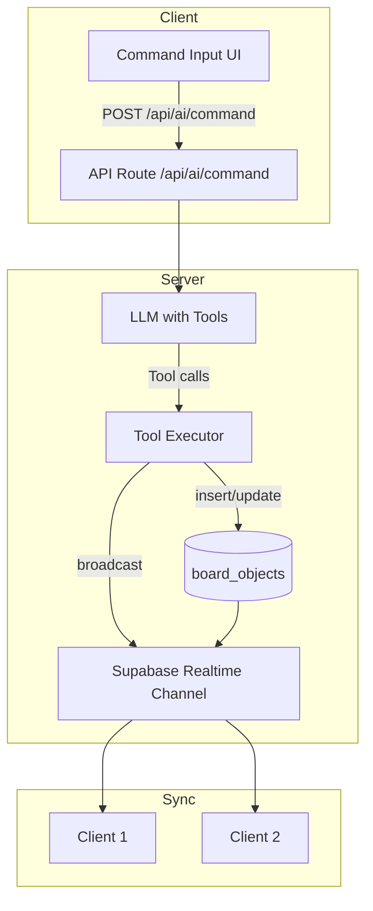

# AI Board Agent Implementation Plan

## Architecture Overview



### Why this architecture

- **Server-side execution**: AI runs on the server (API route) to keep API keys secure and to use a server-side Supabase client. The server writes directly to `board_objects` and broadcasts on the same channel clients use, so all users see AI changes in real-time via the existing `useBoardObjectsSync` flow.
- **Existing sync path**: The current sync uses DB write → broadcast → `applyRemoteObject` (LWW). The AI agent will perform DB writes and broadcast the same payload format. No changes to client sync logic are needed.
- **Concurrency**: Multiple users issuing AI commands write to different (or same) objects. Last-write-wins per object already handles overlaps. Each AI request gets a fresh `getBoardState()` snapshot at invocation start.

---

## Current Gaps vs Requirements

| Requirement     | Current State                            | Gap                                    |
| --------------- | ---------------------------------------- | -------------------------------------- |
| createFrame     | No frame type                            | Add frame type + FrameNode component   |
| createConnector | Line has startShapeId/endShapeId in data | Reuse; add tool wrapper                |
| Color names     | Only hex in COLOR_PRESETS                | Add name→hex mapping                   |
| AI infra        | None                                     | Add Vercel AI SDK or OpenAI, API route |
| Command UI      | None                                     | Add input (command palette or chat)    |

---

## Implementation Phases

### Phase 1: Add Frame Type (Required by Spec)

The spec explicitly requires "Add a frame called 'Sprint Planning'" and "Resize the frame to fit its contents." Frames are first-class.

- Add `frame` to `src/lib/board/types.ts` (`BoardObjectType`)
- Create `FrameNode` component (similar to RectNode, with title in text, distinct visual treatment)
- Add frame rendering in `src/components/CanvasBoard.tsx` (same pattern as RectNode/CircleNode)
- No DB migration needed: type is already text in `board_objects`

### Phase 2: AI Infrastructure

- **Dependencies**: Add `ai` (Vercel AI SDK) and `@ai-sdk/openai` (or openai directly). Vercel AI SDK simplifies tool use and streaming.
- **API route**: `src/app/api/ai/command/route.ts`
  - **Auth**: validate session via `createClient()` (cookie-based)
  - **Input**: `{ boardId: string, command: string }` (Zod)
  - **Board access**: verify user is owner or in `board_members`
  - **Runtime**: Edge (optional) for <2s latency
- **LLM**: Use a fast model (e.g., gpt-4o-mini or gpt-4o) for balance of speed and capability. Multi-step plans favor a capable model.

### Phase 3: Tool Schema and Executors

Define tools matching the spec:

| Tool             | Params                           | Implementation                                              |
| ---------------- | -------------------------------- | ----------------------------------------------------------- |
| createStickyNote | text, x, y, color                | Insert board_objects type=sticky; resolve color name→hex    |
| createShape      | type, x, y, width, height, color | Insert rect or circle                                       |
| createFrame      | title, x, y, width, height       | Insert type=frame                                           |
| createConnector  | fromId, toId, style              | Insert line with data: { startShapeId, endShapeId, endCap } |
| moveObject       | objectId, x, y                   | Update x, y                                                 |
| resizeObject     | objectId, width, height          | Update width, height                                        |
| updateText       | objectId, newText                | Update text                                                 |
| changeColor      | objectId, color                  | Update color; resolve name→hex                              |
| getBoardState    | (none)                           | Select board_objects, return serialized list                |

**Executor design:**

- Create `src/lib/ai/tools.ts` with tool definitions (OpenAI function schema) and executor functions
- Executors use a server-side Supabase client with the user's session (or service role if needed for batch writes)
- After each write: call `supabase.channel(\`board_objects:${boardId}\`).send({ type: "broadcast", event: "board_objects", payload })`with the same shape as`useBoardObjectsSync` (INSERT/UPDATE/DELETE)
- **Color mapping**: Add `src/lib/ai/color-map.ts` with `resolveColor(nameOrHex: string): string` mapping "yellow"→#FDE68A, "blue"→#93c5fd, "pink"→#FCA5A5, "green"→#BBF7D0, etc.
- **Object IDs**: Use `crypto.randomUUID()` for new objects (same as client expectations).

### Phase 4: Agent Loop

- **Single turn**: User command → LLM with tools → execute tool calls → return result to user
- **Multi-step**: LLM may return multiple tool calls in one response; execute all, then optionally feed `getBoardState()` result back for another turn if the model requests it. For complex commands ("Create SWOT analysis"), the LLM typically plans 4+ tool calls in one go.
- **Context**: Pass `getBoardState()` result as system/context so the LLM knows current objects, positions, and colors (e.g., for "move all pink stickies" or "arrange these in a grid").

### Phase 5: Command UI

- Add a command input (e.g., floating input bar or slash-command) in the board header or canvas
- On submit: POST `/api/ai/command` with `{ boardId, command }`
- Show loading state and stream or show final message ("Created 4 quadrants", "Moved 3 notes")
- **Errors**: surface API errors clearly (e.g., "Could not create object")

### Phase 6: Concurrency and Reliability

- **Simultaneous commands**: Each request is independent. LWW per object handles overwrites. No locking.
- **Idempotency**: Tool calls are deterministic given the same board state. Duplicate tool calls (e.g., create same sticky twice) would create duplicates; the LLM should avoid that via context. Optional: add `commandId` to avoid duplicate processing if the same request is retried.
- **Performance**: Use edge runtime, fast model, and batched DB writes where possible (multiple inserts in one transaction if Supabase supports it).

---

## Key Files to Create or Modify

| File                                         | Action                          |
| -------------------------------------------- | ------------------------------- |
| `src/lib/board/types.ts`                     | Add frame to BoardObjectType    |
| `src/components/canvas/FrameNode.tsx`        | **New** – render frame objects  |
| `src/components/CanvasBoard.tsx`             | Add FrameNode to render loop    |
| `src/lib/ai/color-map.ts`                    | **New** – color name→hex        |
| `src/lib/ai/tools.ts`                        | **New** – tool defs + executors |
| `src/app/api/ai/command/route.ts`            | **New** – API route, agent loop |
| `src/components/board/AICommandInput.tsx`    | **New** – UI for commands       |
| `boards/[id]/BoardLayout.tsx` or BoardHeader | Mount AICommandInput            |

---

## Tool Executor → Realtime Flow

The server must broadcast after DB writes so clients see changes. The `useBoardObjectsSync` broadcasts this shape:

```ts
{ op: "INSERT" | "UPDATE" | "DELETE", object?: BoardObjectWithMeta, id?: string, updated_at?: string }
```

The tool executor will:

1. Insert/update/delete in `board_objects` via Supabase
2. Join `board_objects:${boardId}` channel (or use a shared server client with the channel)
3. Call `channel.send({ type: "broadcast", event: "board_objects", payload })` with the same structure

Clients already subscribed to this channel will receive and apply via `applyRemoteObject`.

---

## Why This Plan

- **Reuses existing sync**: No new realtime mechanism. AI writes go through the same DB + broadcast path as manual edits.
- **Server-side = secure**: API keys and tool execution stay on the server. Client only sends the command and receives status.
- **Frame as first-class**: The spec requires frames; modeling them as rect+text would complicate "resize frame to fit contents" and layout logic.
- **Vercel AI SDK**: Clean tool-definition and multi-step handling; widely used and maintained.
- **Phased delivery**: Frame + color mapping enable all tools; then AI infra; then UI. Each phase is independently testable.

---

## Risks and Mitigations

| Risk                            | Mitigation                                                               |
| ------------------------------- | ------------------------------------------------------------------------ |
| Latency >2s on complex commands | Use fast model; edge runtime; consider streaming "thinking" state        |
| LLM hallucinates objectIds      | getBoardState returns ids; tools use existing ids for move/resize/update |
| Broadcast from server fails     | Ensure server Supabase client has valid session; test channel send       |
| Cost at scale                   | Use gpt-4o-mini for most commands; rate-limit per user/board             |

---

## Test Steps

- **Unit**: `resolveColor("yellow")` → #FDE68A; tool executors with mocked Supabase
- **Integration**: POST to `/api/ai/command` with "Add a yellow sticky that says Hello" → verify `board_objects` row and broadcast
- **E2E**: Open board in two tabs; run "Create SWOT analysis" in one; verify both tabs show 4 quadrants
- **Concurrency**: Two users run commands simultaneously; verify no crashes and LWW produces sensible state
